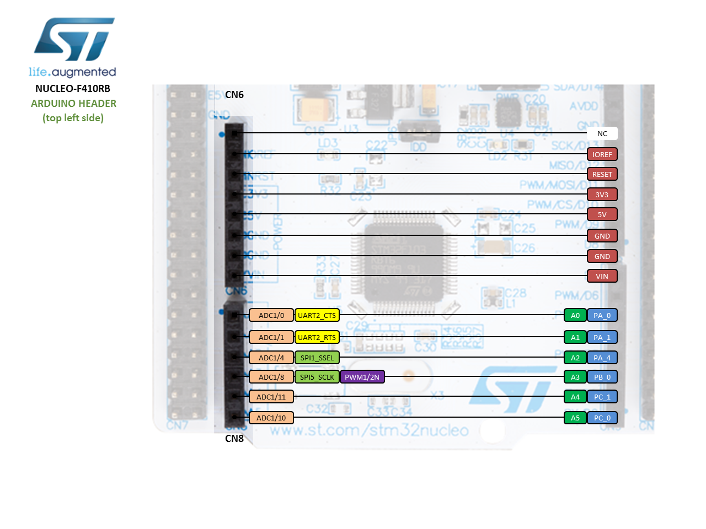
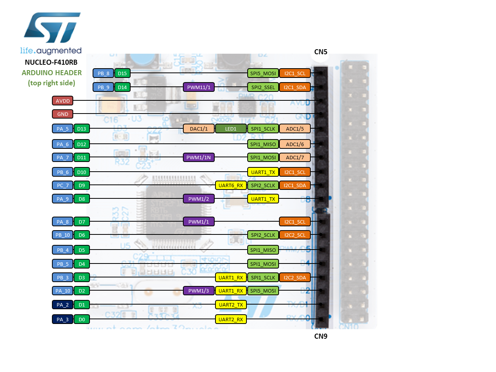
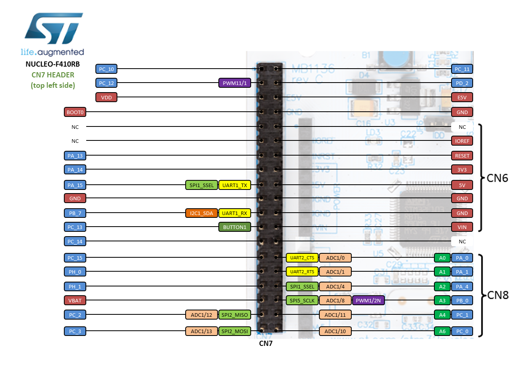
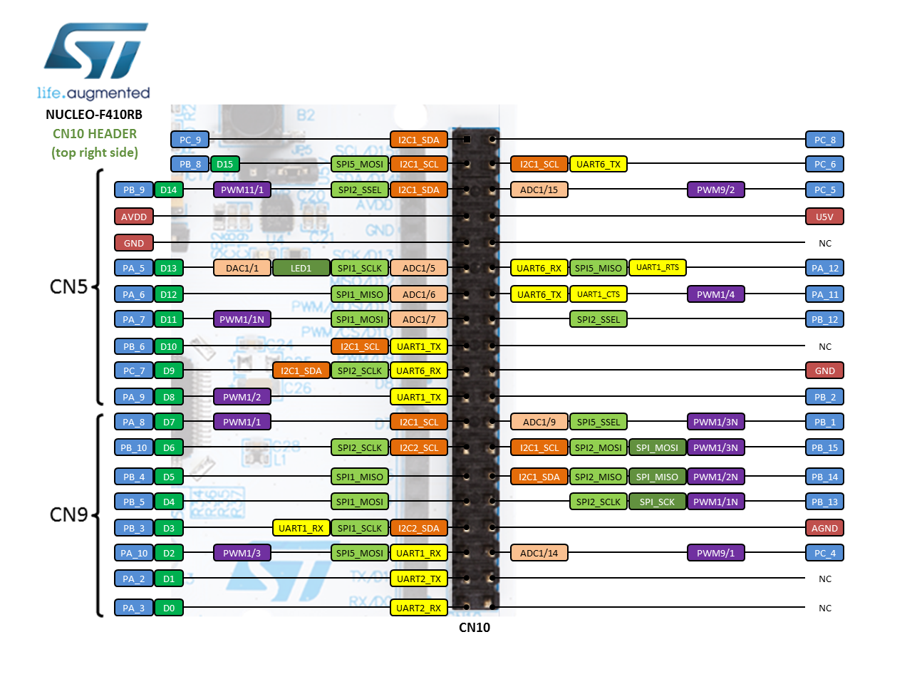
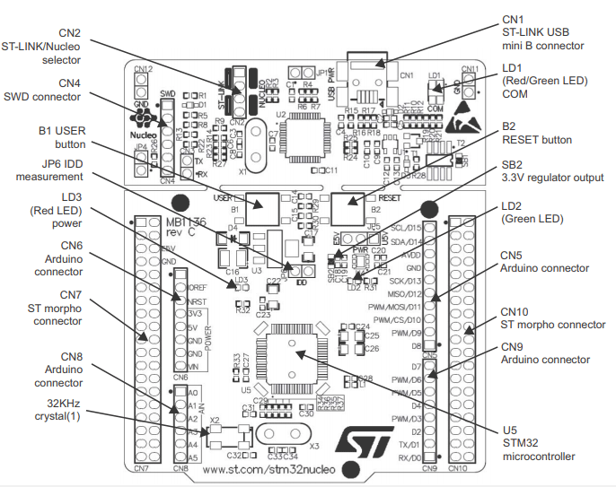

# Nucleo F410RB

## Specifications
- STM32F410RBT6 in LQFP64 package
- ARM® 32-bit Cortex®-M4 CPU with FPU
- Adaptive real-time accelerator (ART Accelerator)
- 100 MHz max CPU frequency
- VDD from 1.7 V to 3.6 V
- 128 KB Flash
- 32 KB SRAM
- General purpose timer (4)
- Low-power timer (1)
- Advanced-control timer (1)
- Random number generator (TRNG for HW entropy)
- SPI/I2S (3)
- I2C (3)
- USART (3)
- GPIO (50) with external interrupt capability
- 12-bit ADC with 16 channels
- 12-bit DAC with 1 channel
- RTC

## Pinouts

